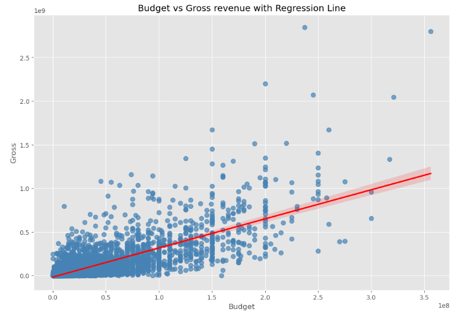
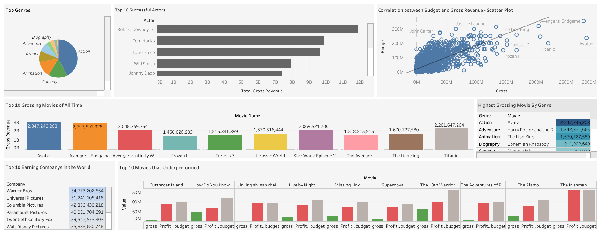

# Movie Industry Data Analysis 🎬🎭

## 📽️ Project Overview
This project analyzes a movie dataset to gain insights into various aspects of the film industry. The dataset includes information about movies, such as their name, genre, budget, gross earnings, company, director, stars, and more. The project involves cleaning the data, performing SQL queries, and creating a Tableau dashboard for visual analysis.

The goal is to:
- ✅ Analyze movie financial performance 
- ✅ Identify top-performing genres, companies, and actors
- ✅ Explore correlations between movie ratings, budgets, and gross earnings
- ✅ Provide data-driven insights into the film industry

🛠️ Technologies Used:
- SQL Server
- Jupyter Notebook
- Python (for data cleaning)
- Pandas
---

## 📂 Dataset: `Movie Industry` 
The dataset contains **real world information** of worldwide films. https://www.kaggle.com/datasets/danielgrijalvas/movies

---

## 🔍 Data Preparation and Exploratory Analysis
## Dataset Exploration
Comprehensive movie dataset analyzed, covering:

Movie details, Release information, Performance metrics, Financial data

Correlation Discoveries:

Strong link between budget and gross revenue (0.74)
Moderate connection between gross revenue and votes (0.61)
Weak relationship between company and gross revenue (0.15).
For example, Budget and Revenue scatter plot:


[Full Jupyter Notebook](film_industry_data.ipynb)
---

## 🛠️ SQL Data Analysis Highlights

### Top Earning Companies
```sql
SELECT TOP 10 company, SUM(gross) as total_gross
FROM movies_df
GROUP BY company 
ORDER BY total_gross DESC
```
**Explanation:** Reveals the most financially successful movie production companies.

### Return on Investment Analysis
```sql
SELECT name, budget, gross, 
       (gross / budget) AS ROI
FROM movies_df 
ORDER BY ROI DESC
```
**Explanation:** Compares movie budgets to their gross earnings to identify the most profitable films.

### Top Directors and Their Most Successful Movie
```sql
SELECT TOP 10 m.director, m.name, m.gross 
FROM movies_df m
JOIN (
    SELECT director, MAX(gross) AS max_gross 
    FROM movies_df 
    GROUP BY director
) AS max_movies
ON m.director = max_movies.director 
   AND m.gross = max_movies.max_gross
ORDER BY m.gross DESC
```
**Explanation:** Reveals top directors along with their highest-grossing film.

### 4. Best Year for Each Company
```sql
SELECT m.company, m.year, m.total_gross
FROM (
    SELECT company, year, SUM(gross) AS total_gross,
           RANK() OVER (PARTITION BY company ORDER BY SUM(gross) DESC) AS rank
    FROM movies_df
    GROUP BY company, year
) AS m
WHERE rank = 1
ORDER BY total_gross DESC
```
**Explanation:** Determines the most financially successful year for each production company.

### Top 3 Highest Grossing Movies Per Genre
```sql
With RankedMovies as (
 SELECT 
        genre, name, gross,
        RANK() OVER (PARTITION BY genre ORDER BY gross DESC) AS rank
    FROM PortfolioProject.dbo.movies_df
)
select genre, name, gross FROM RankedMovies
WHERE rank <= 3
ORDER BY genre, gross DESC;
```

### Correlation Analysis
```sql
SELECT 
    (AVG(votes * gross) - (AVG(votes) * AVG(gross))) /
    (STDEV(votes) * STDEV(gross)) AS votes_gross_correlation,
    (AVG(score * gross) - (AVG(score) * AVG(gross))) /
    (STDEV(score) * STDEV(gross)) AS score_gross_correlation
FROM movies_df
```
**Explanation:** Calculates statistical correlations between votes, scores, and gross earnings.

[More in the full SQL Query file](film_industry_dataset_querys.sql)

---

## 💡 SQL Skills Demonstrated
- 🔍 **Advanced Data Analysis Techniques**
- 🏆 **Ranking and Comparative Analysis**
- 📊 **Aggregation and Summarization**
- 🔢 **Window Functions**
- 🤝 **Complex Subquery and Join Operations**
- 📈 **Statistical Correlation Calculations**
- 🧩 **Complex Filtering and Ranking Strategies**
- 📑 **Common Table Expressions (CTEs)**

---

## 📈 Tableau Dashboard
Used SQL queries to create visualizations in Tableau


---

## 📈 Future Improvements
- Creating indexes on frequently queried columns
- Adding additional data validation rules
- Creating views for common analysis scenarios
